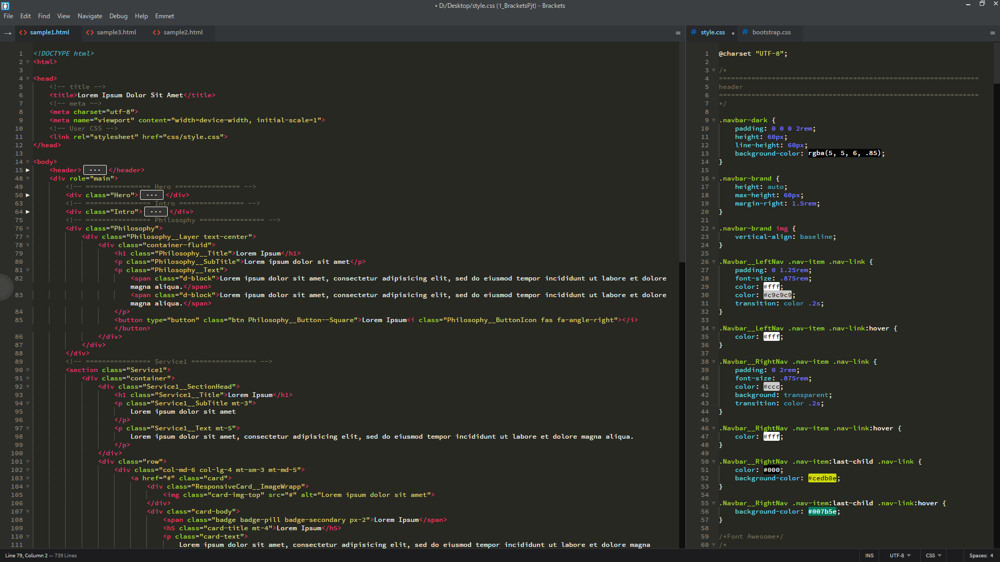
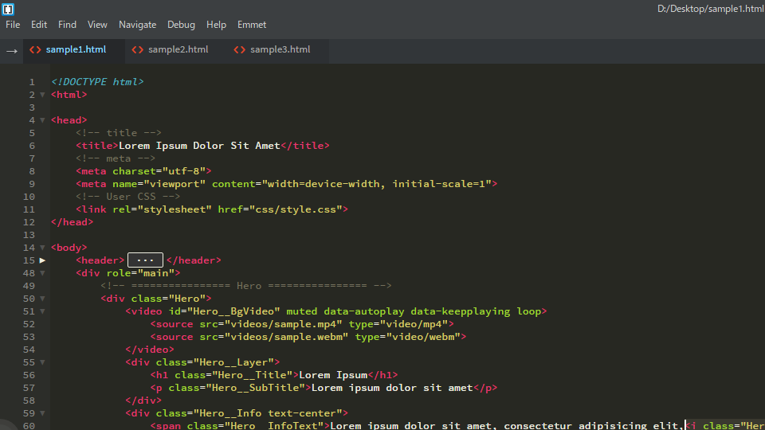
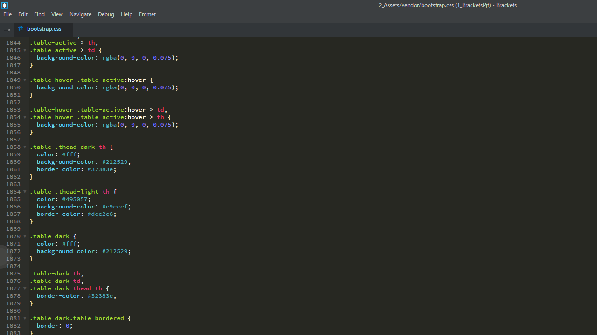
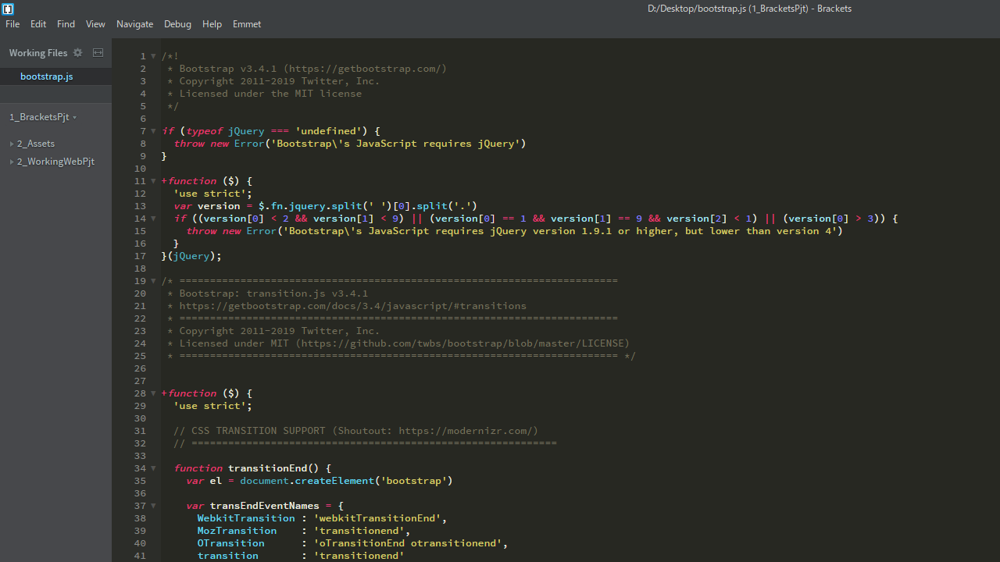
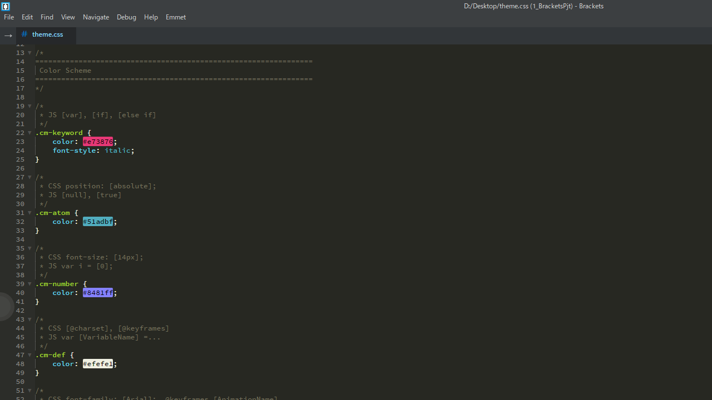

Brackets Theme: Monokai+
===

This theme is a customized version of the Monokai color scheme from [Sublime Text](http://sublimetext.com/). The saturation of respective color optimized for IPS LCD and regular font weight. You can easily edit "theme.css" because it explains where it changes.

Screenshots
---

### Summary

Note: this image using some extensions([Brackets Icons](https://github.com/ivogabe/Brackets-Icons), [Color Highlighter](https://github.com/Taraflex/Brackets-Color-Highlighter), [Custom Work](https://github.com/DH3ALEJANDRO/custom-work-for-brackets), [Indent Guides](https://github.com/lkcampbell/brackets-indent-guides)).

### HTML

### CSS

### JavaScript

### Easy to Customize

Installation
---

This extension requires Brackets Release 1.0 or newer.

1. Open Brackets
2. Open the Extension Manager
3. Switch to "Themes" tab
4. Search for "Monokai+"
5. Click "Install"

License
---

The MIT License.
Read [LICENSE](LICENSE) for further information.
